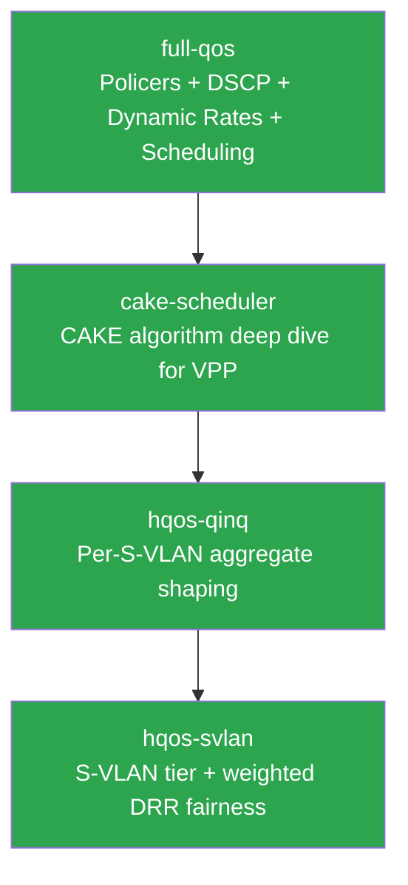

# osvbng-vpp-plugin-qos — Project Summary

This file is the project-level state tracker. Every agent session should read this before starting new work.

**Updated after every spec is finalized.**

**IMPORTANT: Read the First-Class Requirements section in [PROCESS.md](PROCESS.md) before any work. IPv6, CPU efficiency, operational metrics, and memory safety are non-negotiable constraints — not optional enhancements.**

## Current State

VPP plugin for per-subscriber QoS — covering the full pipeline from policing through DSCP marking to CAKE-equivalent scheduling. The plugin skeleton is bootstrapped with the core file structure, binary API, enqueue/dequeue nodes, and CLI commands. Three specs exist: the full-qos spec (covering the complete QoS overhaul including policer enhancements, dynamic rates, DSCP marking, and scheduling), the cake-scheduler spec (deep dive into the CAKE algorithm adaptation for VPP), and the hqos-qinq spec (hierarchical QoS for QinQ deployments with per-S-VLAN aggregate shaping). The cake-scheduler spec has been through Codex (Phase 3) and Gemini (Phase 2) review — all findings accepted, spec finalized in Phase 4. A fourth spec, hqos-svlan, adds a per-S-VLAN aggregate tier with weighted DRR fairness at both aggregate tiers; it is implemented and Phase 6-reviewed (2026-08-12) on feat/hqos-svlan-drr plus an osvbng control-plane branch, with merge gated on the session-parentage and aggregate-correctness PRs and the containerlab suites.

## Specs

| Spec | Status | Summary |
|------|--------|---------|
| [full-qos](specs/full-qos/) | Phase 4 complete (in osvbng-context) | Full QoS overhaul: configurable policer algorithms, dynamic ad-hoc rates, DSCP marking pipeline, live policy updates, show/oper commands, Prometheus metrics, and CAKE scheduling (Phase 5 of this spec) |
| [cake-scheduler](specs/cake-scheduler/) | Phase 4 complete (spec finalized) | CAKE-equivalent per-subscriber scheduler: per-flow queuing, COBALT AQM, DRR, DiffServ tins, triple isolation, overhead compensation, token-bucket shaping. Codex (7 findings) + Gemini (11 findings) reviews — all accepted, 0 rejected. |
| [hqos-qinq](specs/hqos-qinq/) | Phase 5 complete (implemented) | Two-level HQoS: per-port lockless aggregate shaper + per-subscriber CAKE. Auto-attach via interface hierarchy walk, atomic token bucket shared across all workers. Issue [#1](https://github.com/veesix-networks/osvbng-vpp-plugin-qos/issues/1). |
| [hqos-svlan](specs/hqos-svlan/) | Phase 6 complete (implemented, reviewed, benchmarked) | Per-S-VLAN aggregate tier between subscriber CAKE and the port, plus child-driven weighted DRR (no pinning, no hot-path child iteration) so both aggregate tiers share rate fairly instead of serving in pool-index order. Issues [#8](https://github.com/veesix-networks/osvbng-vpp-plugin-qos/issues/8)/[#1](https://github.com/veesix-networks/osvbng-vpp-plugin-qos/issues/1). Implemented on `feat/hqos-svlan-drr` (plugin) and `feat/hqos-svlan-control-plane` (osvbng): DRR both tiers, S-VLAN tier, `_v2` API (v1 CRCs stable), control plane. Phase 6 review (Claude bug hunt + 2 Codex adversarial passes) triaged in DECISIONS.md; §9.3 benchmark gate passed (`tests/perf-rig.sh`). Merge still gated on qos #4-#7 (stacked), session parentage (ipoe #7, pppoe-control #3), and §9.4 containerlab. |

## Spec Dependencies

Legend: green = spec finalized

## Relationship Between Specs

The **full-qos** spec is the parent — it defines the complete QoS pipeline in 5 phases:
- Phases 1-4: Policer enhancements, dynamic rates, DSCP marking, show commands (Go-side + VPP native APIs)
- Phase 5: Scheduling/AQM — "custom VPP plugin" (this repo)

The **cake-scheduler** spec is the detailed design for Phase 5. It covers the VPP plugin architecture, data structures, algorithms, and implementation phases specific to the CAKE adaptation.

Both specs are needed because:
- **full-qos** defines how scheduling integrates with the rest of the QoS pipeline (config schema, service group binding, AAA attributes, subscriber lifecycle, show commands)
- **cake-scheduler** defines how the VPP plugin works internally (node graph, flow hashing, COBALT, DRR, shaping, overhead compensation)

## Key Decisions

### From full-qos (Phase 4 finalization)

- **Per-session QoS state:** `SubscriberPolicerState` tracks policy name, policer index, applied rates, and ad-hoc flag per subscriber — enables bulk update queries and show commands
- **No PolicerAdd migration:** Keep `PolicerAddDel` (already returns `PolicerIndex`), avoid mixed-mode lifecycle complexity with VPP v25.10 API bugs
- **Concurrency:** All policer ops serialize through `policerMu`; bulk update holds lock for entire snapshot+update loop
- **RFC validation:** PIR >= CIR (RFC 2698), CBS/EBS > 0 (RFC 2697), burst >= MTU warnings enforced in conf handler
- **Scheduler replaces egress policer:** When `scheduler.enabled=true` in a QoS policy, the Go component calls the CAKE plugin API instead of creating an egress VPP policer. Ingress direction is unaffected.

### From cake-scheduler (Phase 4 finalization — Codex 7 findings + Gemini 11 findings, all accepted)

- **Two-node design with re-injection:** Enqueue on `ip4-output` / `ip6-output` feature arcs (not `interface-output` — midchain/tunnel interfaces like IPoE/PPPoE sessions bypass `interface-output` via `tunnel-output`). Dequeue as `VLIB_NODE_TYPE_INPUT` polling node. Dequeued packets re-enter the arc with `CAKE_BUFFER_F_SCHEDULED` flag — enqueue sees the flag and passes through via `vnet_feature_next()`. Works on all interface types: physical, VLAN sub-interfaces, and midchain/tunnel session interfaces
- **Buffer ownership invariant:** Enqueue consumes the buffer (does NOT forward to any next node). Five explicit free paths: dequeue transmit, AQM drop, overflow drop, subscriber teardown, handoff congestion
- **No stale feature config:** Dequeue does NOT use a saved `current_config_index`. Re-injection through the enqueue node means `vnet_feature_next()` always uses the live config at transmission time
- **Per-thread per-interface schedulers:** Each worker thread gets its own scheduler instance per interface, matching VPP's multi-TXQ model. Rate split across threads. Rebalance on TX queue placement changes
- **Lazy tin/flow allocation:** Tins allocated on first packet to each DSCP class. Flows use pool allocator (only active flows consume memory). Default 256 flows, configurable to 1024
- **Dual admission control:** Per-subscriber byte limit + global buffer-count watermark (25% of VPP buffer pool). Prevents buffer-pool exhaustion from small packets
- **INPUT node disabled when idle:** `VLIB_NODE_STATE_DISABLED` by default, switched to `POLLING` on first scheduler enable. Zero overhead when unused
- **IPv6 extension header walk:** `ip6_locate_header()` to find L4 ports past extension headers. Non-first fragments fall back to src/dst + fragment ID hash
- **IPv6 flow label is MUST (not optional):** XORed into hash for all IPv6 packets. Critical for QUIC/WireGuard where L4 ports invisible
- **Dequeue frame handling batched:** Single bulk `vlib_get_next_frame`/`vlib_put_next_frame` after per-scheduler loop. Per-packet frame acquisition is prohibited
- **CoDel must use rec_inv_sqrt:** Scaffold's linear `interval/(count+1)` placeholder violates RFC 8289, must not ship
- **BLUE uses proper PRNG:** `clib_random_u32()` per-thread, not `now_us ^ bi`
- **ECN marking uses incremental checksum:** `ip4_header_checksum_update()` for IPv4 1-byte change. IPv6 has no checksum
- **Egress-only:** BNG controls the download bottleneck; upload bufferbloat is the CPE's problem

### From hqos-svlan (Phase 4 finalization — Codex 2 findings + Claude Fable 5 10 findings, all accepted)

- **Child-driven weighted DRR, no pinning:** each child carries its own deficit and refuses itself when spent; parents track only the active-weight sum, updated on activation transitions. Closes issue #8 without walk rotation (PR #9 becomes redundant)
- **Eligibility is `deficit > 0` with bounded debt** (the plugin's own flow-DRR / sch_cake discipline): no packet size can stall a child — jumbo/ATM and unsplit GSO ride the debt mechanism; activation clamps `min(deficit, 0)` so idle earns nothing and forgives no debt
- **Wall-clock 1 ms rounds:** replenishment never depends on packets moving, so the byte-clock deadlock class does not exist
- **Shared S-VLAN deficit is one packed `(round, biased deficit)` word:** refill + admit + decrement in a single CAS mirroring the shipped gate; refund is a bounded fetch_add, paired iff the reserve succeeded
- **Reserve before escape; aggregate burst default 10 ms:** gate burst credit is DRR-unarbitrated, so it is kept at the range floor and deficits stay honest through idle periods
- **Activation atomics own a cache line:** activation frequency tracks sparse traffic (per packet for VoIP-class flows), not config — cacheline0 placement would reintroduce the 7c04b13 bounce
- **DRR check runs before COBALT/ECN in cake_dequeue_one:** a blocked retry (per dispatch, 1000× round frequency) must mutate nothing
- **Barrier-time weight and buffer-charge transfer on backfill/detach:** exact under PR #5's invariant (hard prerequisite); the port side is never decremented on backfill; weight moves only on empty-detect and teardown deactivations, never the defensive bitmap-clear paths
- **Weight validated 1–256, quantum via 128-bit intermediate:** the evaluation-order rule alone still overflows u64 at large multipliers
- **`_v2` messages + capabilities query:** CRC-safe evolution, one binapi call per session bring-up preserved

## Codebase State

| Component | Exists | Notes |
|-----------|--------|-------|
| `src/CMakeLists.txt` | Yes | Build config with `add_vpp_plugin()`, MULTIARCH_SOURCES for enqueue/dequeue/hash |
| `src/osvbng_qos_sched.h` | Yes | Core data structures: `cake_sched_t`, `cake_tin_t`, `cake_flow_t`, `cake_main_t` |
| `src/osvbng_qos_sched.c` | Yes | Plugin init, DSCP tables, CoDel cache, enable/disable logic, CLI commands |
| `src/osvbng_qos_sched_api.c` | Yes | API handlers for enable/disable, dump, reset stats |
| `src/osvbng_qos_sched.api` | Yes | Binary API definitions (v1.0.0) |
| `src/cake_enqueue.c` | Yes | Enqueue nodes on ip4-output/ip6-output arcs |
| `src/cake_dequeue.c` | Yes | Dequeue INPUT node (scaffolded, inline COBALT, TODOs for proper DRR) |
| `src/cake_hash.c` | Yes | Stub for SIMD batch flow hashing |
| `src/cake_cobalt.c` | Yes | COBALT AQM stub (Newton-Raphson, control law) |
| `src/cake_overhead.c` | Yes | Overhead preset table |
| `context/` | Yes | Workflow docs, full-qos spec, cake-scheduler spec |

## What's Next

The cake-scheduler spec is finalized (Phase 4 complete). All Codex findings accepted and incorporated. The hqos-qinq spec is finalized (Phase 4 complete) with all 4 Codex findings accepted. Next steps:

1. **cake-scheduler Phase 5: Implementation** — Update the scaffold code in `src/` to match the finalized spec (re-injection design, buffer ownership, lazy allocation, INPUT node state management, IPv6 extension header walk)
2. **cake-scheduler Phase 6: Code review** — Post-implementation review by Codex and/or Gemini
3. **hqos-qinq Phase 5: Implementation** — Aggregate lifecycle (under worker barrier), unified interleaved dequeue loop, draining state, explicit thread placement API
4. **hqos-qinq Phase 6: Code review** — Post-implementation review
5. **hqos-svlan merge** — Phases 5 and 6 are complete (2026-08-12; see specs/hqos-svlan/PHASE6_VERIFICATION.md). Remaining gates: qos #4/#5/#6/#7 in the stacked fix/aggregate-shaper-correctness order, session parentage (ipoe #7, pppoe-control #3), §9.4 containerlab 18/19, and first contact between the osvbng control plane and a live dataplane. Follow-up issues to file: shaper cost-floor precision at 40-100G, hot-path batching (Requirement #2 debt)
